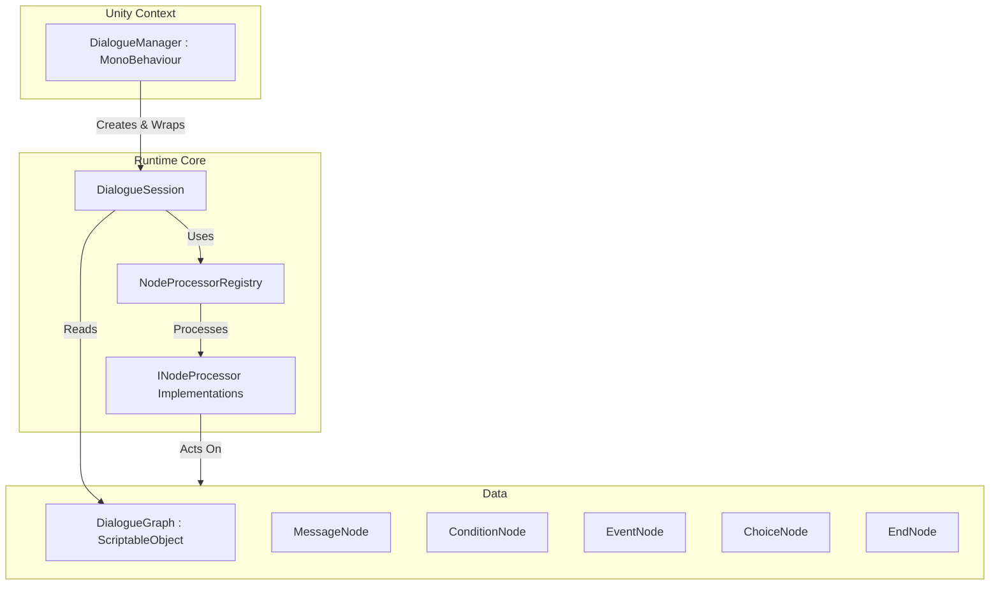

# Dialogue Framework

A decoupled, data-driven, and highly extensible framework for managing dialogue sequences in UnityVisionToolkit.

## Architecture Diagram



## Class Relationship
- **DialogueManager**: The Unity `MonoBehaviour` entry point. Use this to start and stop dialogues in your scenes and hook up UI events.
- **DialogueSession**: A pure C# class that handles the core runtime logic and traversal of the graph. It maintains state and evaluates conditions.
- **NodeProcessorRegistry**: Maps Node types to specific `INodeProcessor` implementations, allowing OCP-compliant logic execution.
- **Nodes (`MessageNode`, `ConditionNode`, etc.)**: Pure data containers representing steps in the conversation flow. `MessageNode` has `PortraitKey`, `BackgroundKey`, and `Metadata` for custom behavior decoupling from specific Unity APIs.

## Execution Flow
1. User calls `DialogueManager.StartDialogue(graph, context)`.
2. Manager initializes a `DialogueSession` and sets the `DialogueContext`.
3. The Session transitions to the `StartNodeId`.
4. The Session determines the node type, retrieves the correct `INodeProcessor` from the `NodeProcessorRegistry`, and calls `Process()`.
5. The Processor executes logic (e.g., evaluating conditions or invoking events) and tells the Session which node to transition to next.
6. The process repeats until an `EndNode` is reached or the dialogue is stopped.

## Example Usage
```csharp
public DialogueManager manager;
public DialogueGraph graph;

void Start() {
    manager.OnDialogueNodeEnter += (node) => {
        Debug.Log($"{node.Speaker}: {node.Content}");
    };
    manager.StartDialogue(graph);
}
```

## Extension Points
- **Nodes**: Create a new class inheriting from `BaseDialogueNode` and register an `INodeProcessor` via the `NodeProcessorRegistry`.
- **DialogueState**: Provides a serializable snapshot of the session (e.g. `CurrentNodeId`), useful for integration with external Save/Load systems.
- **Metadata**: Attach arbitrary Key-Value string pairs to a `MessageNode` to trigger specialized audio, animations, or timeline tracks without muddying the core node structure.
